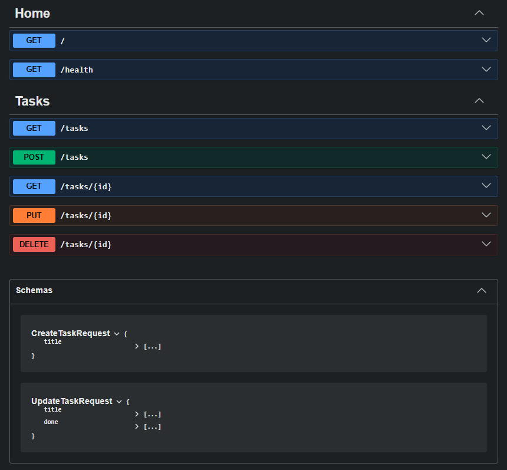

# Task API

A simple ASP.NET Core Web API that demonstrates CRUD (Create, Read, Update, Delete) operations using an in-memory list of tasks. This project was developed as a backend API assignment and does not use a database.

## Features

* Get API information
* Health check endpoint
* Get all tasks
* Get a single task by ID
* Create a new task
* Update an existing task
* Delete a task
* Interactive API documentation using Swagger

## Technologies Used

* ASP.NET Core Web API (.NET 10)
* C#
* Swagger / OpenAPI
* Postman (for testing)

## Installation & Running

1. Clone the repository:

```bash
git clone https://github.com/YOUR_USERNAME/TaskAPI.git
```

2. Open the project in Visual Studio.

3. Press **F5** or **Ctrl + F5** to run the application.

4. Open Swagger:

```
https://localhost:YOUR_PORT/swagger
```

## API Endpoints

| Method | Endpoint    | Description               |
| ------ | ----------- | ------------------------- |
| GET    | /           | Returns API information   |
| GET    | /health     | Returns API health status |
| GET    | /tasks      | Returns all tasks         |
| GET    | /tasks/{id} | Returns a specific task   |
| POST   | /tasks      | Creates a new task        |
| PUT    | /tasks/{id} | Updates an existing task  |
| DELETE | /tasks/{id} | Deletes a task            |

## Example cURL Request

```bash
curl -i -X POST https://localhost:YOUR_PORT/tasks ^
-H "Content-Type: application/json" ^
-d "{\"title\":\"Learn ASP.NET Core\"}"
```

Example Response:

```http
HTTP/1.1 201 Created
```

```json
{
  "id": 4,
  "title": "Learn ASP.NET Core",
  "done": false
}
```

## Swagger UI

Open the following URL after running the application:

```
https://localhost:YOUR_PORT/swagger
```

Swagger screenshot:



## Notes

* Tasks are stored in memory only.
* Data is reset every time the application restarts because no database is used.

## Author

Mehmood Ahmed
